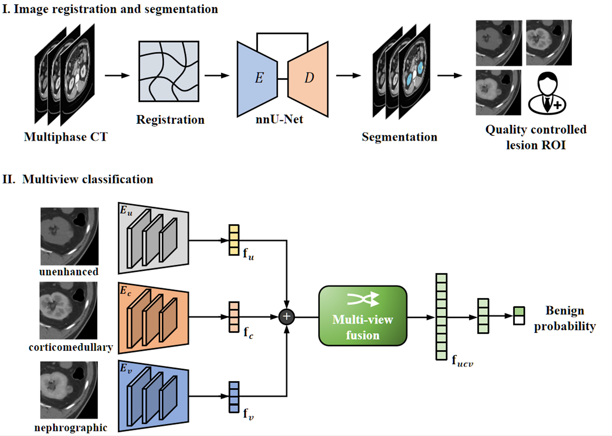

# Renal-Mass-AI
This repo contains the scripts for the segmentation, pre-processing and CNN-based prediction for identifying benign small renal masses at contrast-enhanced multiphase CT, as reported in the paper **Deep Learning Assessment of Small Renal Masses at Contrast-enhanced Multiphase CT**.

[[paper](https://pubs.rsna.org/doi/full/10.1148/radiol.232178)]



## Dependencies
To install Python dependencies:
```
pip install -r requirements.txt
```

## Tumor segmentation
We employed the nnUNet (Version 1) framework to perform the segmentation of kidney and tumors. Please refer to the [nnUNet repository](https://github.com/MIC-DKFZ/nnUNet/tree/nnunetv1) for the configuration settings. The task ID for kidney tumor segmentation is 135 and segmentation models trained on [KiTS](https://kits19.grand-challenge.org/data/) can be downloaded. To use nnUNet directly:

```
nnUNet_predict -i INPUT_FOLDER -o OUTPUT_FOLDER -t 135 -m 3d_lowres
```
where INPUT_FOLDER is the folder of arterial phase CT images (*.nii.gz) and OUTPUT_FOLDER is the folder. Segmentation labels: kidney (label 1), tumor (label 2) and cyst (label 3).

## Image preprocessing
Base on the segmentation results, we located and cropped the kidney tumor. The axial slice with maximum tumor area was extracted (reviewed by experts) and resampled to a spatial resolution of 0.625×0.625 mm, followed by cropping with an ROI of 224×224 px centering the tumor mass center. For the segmentation failure, the mass center was manually placed. 

Please see the [preprocess](./preprocess) folder for details. 

## Deep learning models
We developed a multi-view CNN with an intermediate feature fusion strategy. The image features were extracted with ResNet18 backbone and fused to make downstream task. The architecture was the same for the malignancy and invasiveness prediction tasks. 
Please see the [DL](./DL) folder for implementation details. 

Train:
```
python ./DL/train_malignancy_classification_NAV.py --epoch 200 --tag test --lr 1e-5
```

Test:
```
python ./DL/test_malignancy_classification_NAV.py
```

If you have any question, please feel free to contact (shuowang@fudan.edu.cn).

